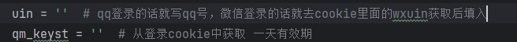
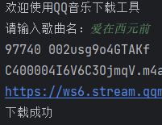
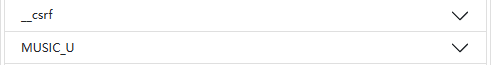
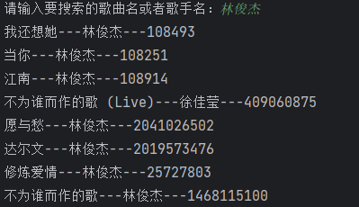
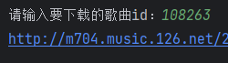

# 有很多地方可以优化，大家就去自己优化吧。我懒得搞了哈哈

> [qq音乐](#qq音乐下载工具)
> [网易云音乐](#网易云音乐下载工具)
> [酷狗音乐](#酷狗)

## QQ音乐下载工具

1. 先去网页版登录，从cookie中获取qm_keyst
   （有效期为一天，说是一天，但是测试下来好像能用挺久的）
   （必须是绿钻的，非绿钻的下不了vip音乐）
   qq登录的话uin就是qq号，微信登录的话就是cookie中的wxuin

2. 将qm_keyst与uin写入，uin即为QQ号

   

3. 启动mian.py，输入歌曲名即可下载

   

4. 当前下载的是默认搜索到的第一首歌曲，如果要选择的话，将搜索结果那部分修改即可，网页版限制搜索结果最多10条。

## 网易云音乐下载工具

1. 先去网页版登录，从cookie中获取MUSIC_U和__csrf

2. 启动main.py，输入歌曲名获取搜索结果，这个搜索结果默认30条，可以根据需求修改。

3. 选择歌曲，输入歌曲id即可下载。

## 酷狗

1. 先去网页版登录，获取对应的cookie，有效期挺长的好像，获取完在main中填入即可。
   
2. 启动main.py，输入歌曲名后搜索内容有30条，同样是网页版限制。
3. 大致流程与网易云的差不多
